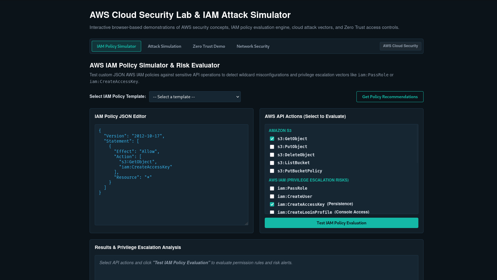
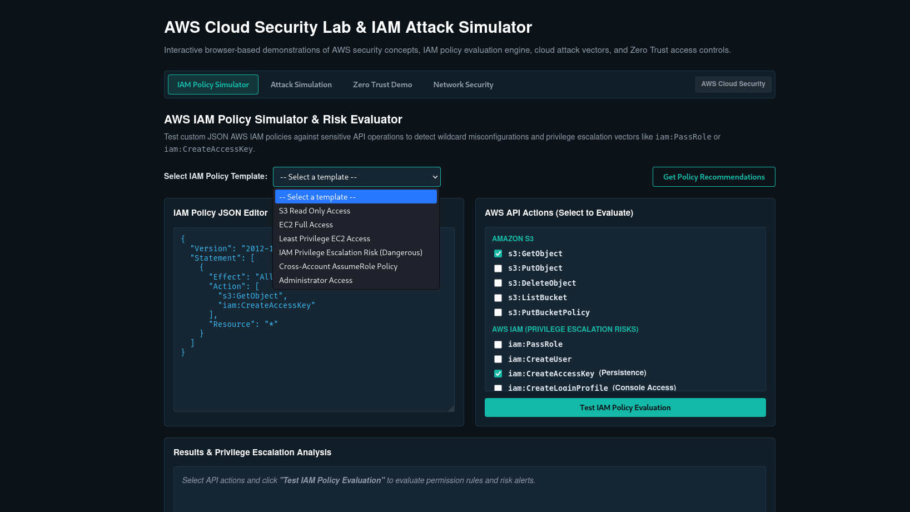
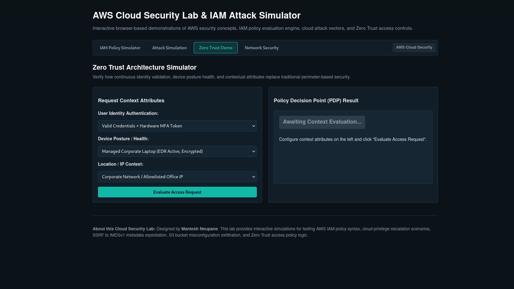
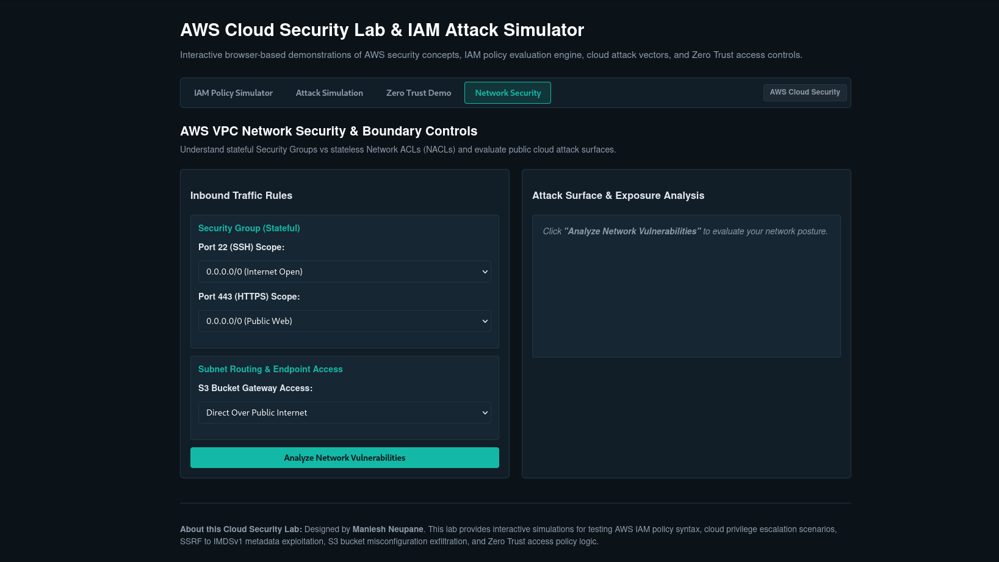

# AWS Cloud Security Lab & IAM Attack Simulator

An interactive, browser-based simulator for learning how AWS IAM authorization actually works. Paste in a real IAM policy, get an instant risk breakdown, watch how a small misconfiguration chains into a full account takeover, then see how Zero Trust conditions stop that same attack cold.

**Live demo:** https://manieshneupane.com.np/blog/AWS-Security-Lab/
**Full write-up:** https://manieshneupane.com.np/blog/



> This repository documents the project. The lab itself runs at the live demo link above.

---

## Why This Exists

Most cloud security "bugs" aren't code bugs at all — they're permissions that were scoped too loosely. Reading AWS documentation about IAM evaluation order or `iam:PassRole` escalation is one thing; watching a policy actually get evaluated, watching an attack chain execute step by step, and watching a Zero Trust condition block it is what makes the mental model click.

This lab exists to close that gap for anyone moving from application security into cloud/AWS security — engineers, security researchers, and students alike. Everything runs client-side: no AWS account, no credentials, no backend, nothing ever touches real infrastructure.

---

## The Four Modules

### 1. IAM Policy Simulator



The core of the lab. You pick a policy template (or paste your own), select which AWS API actions to test it against, and the engine evaluates the policy the same way AWS's real control plane does.

**How it works:**
- Paste any JSON IAM policy into the editor
- Select specific API actions to test — S3 actions (`GetObject`, `PutObject`, `DeleteObject`, `ListBucket`, `PutBucketPolicy`) and high-risk IAM actions (`PassRole`, `CreateUser`, `CreateAccessKey`, `CreateLoginProfile`, and more)
- Click **Test IAM Policy Evaluation** to run it
- Results panel shows exactly which actions are allowed, denied, or flagged as privilege-escalation risks
- A **Get Policy Recommendations** button suggests a tightened, least-privilege version of the policy

**Evaluation logic mirrors AWS exactly:**
```
Implicit Deny (default)  →  Explicit Deny (always wins)  →  Explicit Allow  →  Final decision
```

**Risk patterns it flags automatically:**
- `iam:PassRole` combined with compute-launch permissions (`ec2:RunInstances`, etc.) — the classic privilege-escalation primitive
- `iam:CreateAccessKey` — flagged as a **persistence** risk (creates a durable backdoor credential)
- `iam:CreateLoginProfile` — flagged as a **console access** risk (opens a GUI login path)
- `iam:AttachUserPolicy` / `iam:PutUserPolicy` — self-escalation paths
- `iam:UpdateAssumeRolePolicy` — trust-policy tampering
- Any of the above scoped to `"Resource": "*"` instead of a specific ARN

Risk is scored **Low / Medium / High / Critical** per finding.

### 2. Attack Simulation


Step-by-step walkthroughs of real-world AWS attack chains, showing exactly where a control-plane misconfiguration (found in Module 1) meets an infrastructure-layer flaw to produce full account compromise:

- **SSRF → instance metadata credential theft** — how a web app vulnerability on an EC2 instance leads to stolen IAM credentials, and why IMDSv2 blocks it
- **Public S3 bucket exploitation** — automated bucket enumeration and exfiltration
- **CloudTrail logging evasion** — how attackers blind the audit trail before continuing
- **Lambda persistence insertion** — backdooring running serverless code
- **KMS key disablement** — cloud-native ransomware without any malware at all

### 3. Zero Trust Demo



Shows how context-aware IAM conditions stop the attack chains from Module 2 — even when credentials have already leaked:

- `aws:SourceIp` — restrict actions to trusted network ranges
- `aws:PrincipalOrgID` — restrict cross-account access to your own AWS Organization
- `aws:MultiFactorAuthPresent` — require an active MFA session before destructive actions
- Explains the three nested permission ceilings: Service Control Policies → Permissions Boundaries → Identity-based policies

### 4. Network Security



Covers the network-layer controls that sit alongside IAM as defense in depth:

- Security Groups (stateful, instance-level) vs. Network ACLs (stateless, subnet-level)
- VPC Endpoints — Gateway Endpoints (S3/DynamoDB) and Interface Endpoints (AWS PrivateLink) — and how they keep traffic off the public internet entirely

---

## Real-World Grounding

The attack chain modeled in Module 2 (SSRF → IMDSv1 → stolen credentials → S3 exfiltration) isn't hypothetical — it mirrors the 2019 breach of a major U.S. financial institution, one of the most-cited real-world examples of why IMDSv2 and least-privilege IAM are non-negotiable hardening steps.

## Related Write-Up

A full technical deep dive covering the IAM evaluation logic, all five privilege-escalation vectors, Zero Trust condition keys, and the real-world breach this lab is modeled after:
[Deep Dive into the AWS Cloud Security Lab](https://manieshneupane.com.np/blog/)

## About

Built by **Maniesh Neupane** ([@pwn4arn](https://x.com/pwn4arn)) — Web Application Penetration Tester and Bug Bounty Researcher, 3+ years across 30+ programs and 90+ disclosures, transitioning into AWS Cloud Security.

- Portfolio: [manieshneupane.com.np](https://manieshneupane.com.np)
- LinkedIn: [Maniesh Neupane](https://np.linkedin.com/in/manieshneupane)
- Bugcrowd: ManieshNeupane18
- Hall of Fame: Apple Security, Google VRP, Microsoft MSRC
